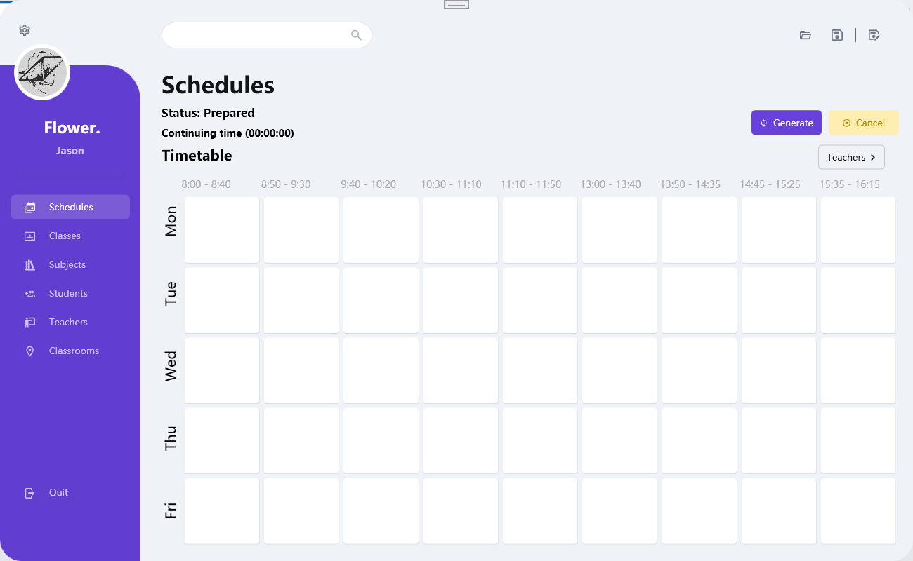

# Class_Scheduler

A class scheduler app using C# WPF, based on Prism Framework.

Main View:

It has following features:

- Add subjects, students, teachers and classrooms data through pop-up windows.
- Add those data through Excel File.
- Generate the classes based on number of students selected, their scores and the maximum students a single class could hold in the setting windows.
- Generate the timetable given the unavailable time for all people, and for some teachers using Dynamic Programming *(The program based on genetic Algorithm is still in optimizing)*.
- Show the windows for teachers.
- Save and Load Files in Xml.

Here's the template for the input excel files:

https://docs.google.com/spreadsheets/d/1mkMWD4lIUhxbKrFfPRMYs2_WRILkVyvT/edit?usp=drive_link&ouid=105642039527538723638&rtpof=true&sd=true

YouTube Link: [A Class Scheduler Program developed for school using C# WPF. (IB Computer Science IA) - YouTube](https://www.youtube.com/watch?v=lulCZvG_kkA&lc=UgxAnQXy76KkirCjwmh4AaABAg)

Follow Me: [Alison Zhang - YouTube](https://www.youtube.com/@alisonzhang702)

